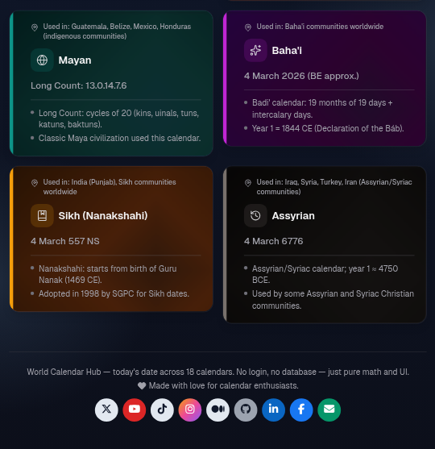

# 📅 World Calendar Hub

<p align="center">
  
</p>

<p align="center">
  <strong>🌐 <a href="https://world-calendars.vercel.app/">Live website → world-calendars.vercel.app</a></strong>
</p>

<p align="center">
  Today’s date in 18 major calendars — converters, holidays, and quick facts. No login, no database — just pure math and UI.
</p>

---

## 🌍 About

This calendar was made by me as a Christian, loving the world 🌍 and with the idea of world peace ☮️ in mind. It brings together many of the world’s calendar traditions in one place so we can see each other’s time and celebrate together.

---

## ✨ Features

- **📆 18 calendars** — Gregorian, Islamic (Hijri), Chinese (Lunar), Hindu (Vikram Samvat), Hebrew, Ethiopian, Persian (Solar Hijri), Japanese, Buddhist, Coptic, Thai Solar, Korean, Javanese, Armenian, Mayan, Baha’i, Sikh (Nanakshahi), Assyrian
- **🗓️ Full year & month views** — Click any calendar to see the full year; click any month for a detailed month view with holidays
- **🎉 Holidays & traditions** — Observances and descriptions in English (and original script where relevant) for each calendar
- **🔄 Date converter** — Pick a date and convert it to any of the 18 calendar systems
- **🌙 Dark / light mode** — Toggle on every page
- **📱 Responsive** — Layout and touch targets tuned for mobile, tablet, and desktop
- **🎨 Per-calendar themes** — Each calendar has its own gradient and accent on the hub and in its views

---

## 🛠️ Tech stack & languages

<p align="center">
  
  
  
  
  
  
</p>

| Category        | Technologies |
|----------------|--------------|
| **Language**   | TypeScript, JavaScript (JSX) |
| **Framework**  | Next.js 16 (App Router), React 19 |
| **Styling**    | Tailwind CSS 3, CSS3 |
| **Date logic** | Luxon, hijri-date, chinese-lunar, @hebcal/core |
| **UI**         | Lucide React (icons), next-themes (dark mode) |

---

## 🚀 Getting started

**Requirements:** Node.js **≥ 20.9.0**

1. **Clone the repo**
   ```bash
   git clone https://github.com/raimonvibe/world-calendars.git
   cd world-calendars
   ```

2. **Install dependencies**
   ```bash
   npm install
   ```

3. **Run the dev server**
   ```bash
   npm run dev
   ```
   Open [http://localhost:3000](http://localhost:3000) in your browser.

4. **Build for production**
   ```bash
   npm run build
   npm start
   ```

---

## 📜 Scripts

| Command        | Description              |
|----------------|--------------------------|
| `npm run dev`  | Start development server |
| `npm run build`| Build for production     |
| `npm start`    | Run production build     |
| `npm run lint` | Run ESLint               |

---

## 📁 Project structure (overview)

```
world-calendar-hub/
├── app/                    # Next.js App Router
│   ├── page.tsx            # Home (calendar cards)
│   ├── convert/            # Date converter
│   ├── calendar/[id]/      # Year view
│   └── calendar/[id]/[year]/[month]/  # Month view
├── components/             # React components
│   ├── CalendarCard.tsx
│   ├── Footer.tsx
│   └── calendar/           # Year/month layouts & views
├── lib/                    # Data & logic
│   ├── calendars.ts        # Today’s date per calendar
│   ├── converters.ts       # Date conversion
│   ├── calendarThemes.ts   # Gradients & accents
│   └── holidays/           # Holiday definitions per calendar
└── public/                 # Static assets
```

---

## 📄 License

This project is open source. Use it in a spirit of respect and peace ☮️.

---

<p align="center">
  Made with 🌍 and ☮️ for calendar enthusiasts everywhere.
</p>
